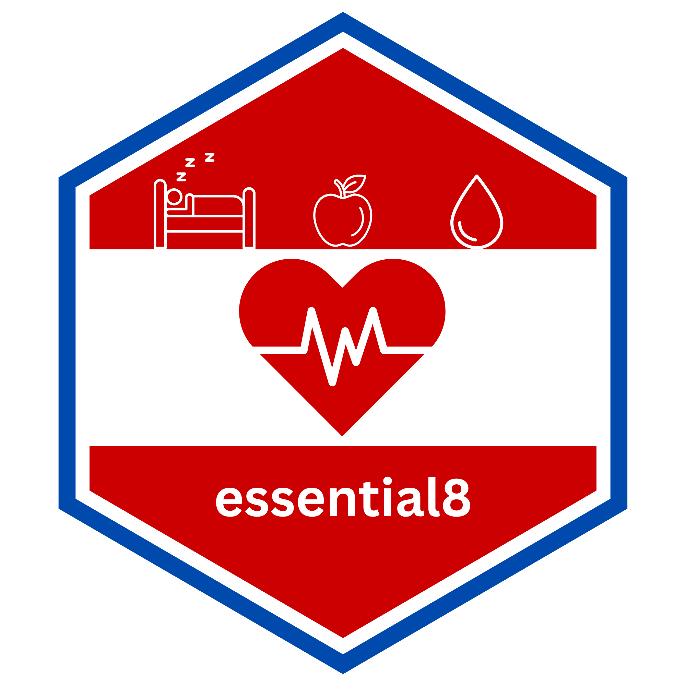

# essential8 

<!-- badges: start -->
<!-- badges: end -->

## Overview
`essential8` provides a reproducible R implementation of the American Heart 
Association Life’s Essential 8 scoring framework for adult and pediatric 
populations, including component-level and composite cardiovascular health scores.

## Installation

### CRAN
```r
install.packages("essential8")
```

### Development

```r
#install.packages("remotes")
remotes::install_github("thatoneguy006/essential8")
```

# Disclaimer
`essential8` is independent research software and is NOT affiliated with,
sponsored by, approved by, or endorsed by the American Heart Association.
